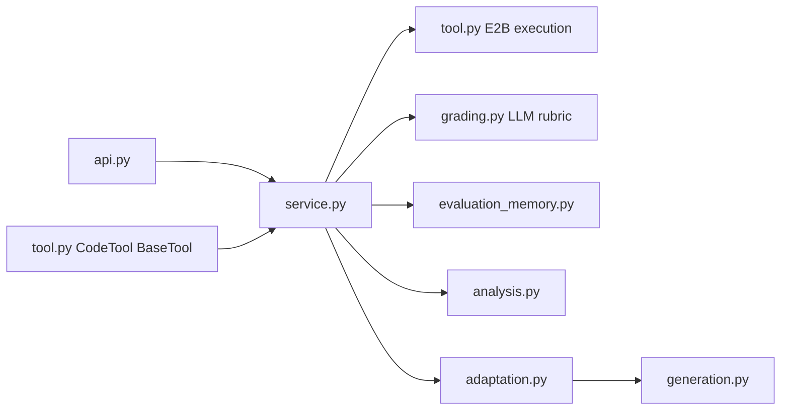

# Code Execution Feature

Adaptive coding assessment with E2B sandbox execution, LiteLLM challenge
generation/grading, platform memory rows, and an examiner-agent `BaseTool`.

## Architecture



| File | Responsibility |
|------|----------------|
| `api.py` | REST routes under `/api/v1/code` |
| `service.py` | Challenge CRUD, sandbox submit, adaptive submit orchestration |
| `tool.py` | E2B execution helpers plus examiner-agent `CodeTool` |
| `grading.py` | Silent LLM rubric persistence into `grade_results` |
| `evaluation_memory.py` | Silent memory-card extraction |
| `analysis.py` | Skill dimension aggregation |
| `adaptation.py` | Next-question contract from scores, learner profile, and admin config |
| `generation.py` | LLM-authored Python/JavaScript challenges |
| `languages.py` | Per-language sandbox runner and generator prompt rules |

## Examiner Agent Contract

`CodeTool` implements `BaseTool` and accepts `CodeToolInput`:

- `challenge_id`
- `session_id`
- `assessment_id`
- `submitted_code`
- `question_index`
- `difficulty`

It returns `CodeToolOutput`:

- `received`
- `submission_id`
- `contract`

The output is intentionally silent: it does not include sandbox score, LLM
rubric feedback, test details, memory-card evidence, or cumulative dimension
scores. Those records are persisted for platform reporting and adaptation only.

## Adaptive Loop

Official submit runs four layers:

1. E2B sandbox execution plus LLM rubric persistence.
2. Memory-card extraction into `memory_cards` and `code_memory_cards`.
3. Skill dimension aggregation into `skill_dimension_scores`.
4. Adaptive contract computation for the next coding challenge.

The learner-facing API returns a safe contract containing only the fields needed
to continue the flow. Challenge generation recomputes the rich contract
server-side from the database, so private memory summaries never need to round
trip through the browser.

## Memory Card Schema

The platform row in `memory_cards` stores the cross-tool evidence card:

| Column | Contents |
|--------|----------|
| `session_id` | Platform assessment session UUID |
| `tool_type` | Always `coding` |
| `question_index` | Zero-based question position |
| `difficulty` | Difficulty of the answered question |
| `evidence_summary` | Private examiner summary derived from sandbox + rubric |
| `dimension_signals` | JSON flags for `thinking`, `work`, and `digital_ai` |
| `passed` | Official sandbox pass/fail |

The coding detail row in `code_memory_cards` stores code-specific private
evidence linked by `memory_card_id`:

| Column | Contents |
|--------|----------|
| `submission_id` | Source `code_submissions.id` |
| `sandbox_score` | Weighted E2B correctness score |
| `overall_rubric_score` | Blended overall score from `grade_results.rubric_scores` |
| `test_results` | JSON array of structured sandbox results, including hidden tests |
| `approach_feedback` | LLM approach feedback |
| `efficiency_feedback` | LLM efficiency feedback |

These rows are used by adaptation/reporting only. They are not returned from
`/adaptive-submit` and are not rendered during the active learner session.

## Adaptation Policy

`adaptation.py` reads both platform tables when available:

- `assessment_sessions.learner_profile_json` chooses the first difficulty from
  learner level (`junior`/`beginner`, `mid`/`intermediate`,
  `senior`/`advanced`).
- `assessments.blueprint_json` or `assessments.tool_config` configures:
  - `coding.max_questions`
  - `coding.initial_difficulty`
  - `coding.difficulty_thresholds.intermediate`
  - `coding.difficulty_thresholds.advanced`

Example:

```json
{
  "coding": {
    "max_questions": 4,
    "initial_difficulty": "intermediate",
    "difficulty_thresholds": {
      "intermediate": 4,
      "advanced": 8
    }
  }
}
```

If no thresholds are configured, score-based difficulty escalation is not
inferred. If no max-question value is configured, the loop stops only when the
platform session is completed or expired.

## APIs

Base path: `/api/v1/code`

| Method | Path | Description |
|--------|------|-------------|
| `GET` | `/languages` | Supported sandbox languages |
| `POST` | `/generate-challenge` | Generate and persist the next LLM-authored challenge |
| `POST` | `/adaptive-submit` | Official submit; silently grades, stores memory, and adapts |
| `POST` | `/submissions` | Practice sandbox run used by **Run tests** |
| `GET` | `/submissions/{id}` | Submission details, used for practice runs |
| `POST` | `/challenges` | Manual challenge creation |
| `GET` | `/challenges` | Manual challenge listing |
| `GET` | `/challenges/{id}` | Challenge detail with hidden expected outputs omitted |

## E2B Execution

- Python writes `solution.py` and `runner.py`; JavaScript writes `solution.js`
  and `runner.js`.
- Sandbox creation uses an E2B timeout, command execution uses the challenge
  time limit, and the host coroutine wraps the whole operation with
  `asyncio.wait_for`.
- Timeout and cold-start timeout paths return `sandbox_timeout` and kill the
  sandbox best-effort.
- Missing API keys return `sandbox_unavailable`.

Requires `E2B_API_KEY` for cloud sandboxes. When unset (or on SDK import failure in
development), the backend falls back to a local Python/Node subprocess runner.

## Performance (LLM + submit latency)

| Setting | Default | Effect |
|---------|---------|--------|
| `CODE_ASYNC_GRADING` | `true` | `POST /adaptive-submit` returns after sandbox + heuristic grade (~2s); full LLM rubric runs in background |
| `LITELLM_MODEL` | — | Use `openai/FW-Kimi-K2.6` for Sprint.ai proxy; Kimi skips structured output |
| Generation token cap | 4096 | Kimi reasoning models need headroom before JSON answer block |

Typical learner-facing timings (local dev, Kimi):

- `POST /submissions` (Run Code): ~1–2s
- `POST /adaptive-submit` (Submit): ~1–3s with async grading
- `POST /generate-challenge` (next question): ~20–45s (LLM-bound)

Set `CODE_ASYNC_GRADING=false` to block submit on full LLM grading (legacy).

## Frontend Behavior

UI follows the Stitch mockup
`ExtraDocs/stitch_masaar_voice_assessment_ui/coding_challenge_masaar` (two-column
layout, progress header, dark editor, console panel).

| Surface | Path / import |
|---------|----------------|
| Standalone demo | `/code` |
| Embeddable component | `import { CodeChallengeView } from "@/features/code"` |

Integration props for the examiner / assessment shell:

- `sessionId`, `assessmentId` — platform UUIDs from `assessment_sessions`
- `mode="embedded"` — hides standalone-only chrome
- `autoStart` — skip language picker when the examiner invokes the tool
- `questionNumber`, `totalQuestions`, `timeLimitSeconds` — header progress/timer
- `onExit`, `onSessionComplete`, `onSubmitted` — shell callbacks

`Run Code` is practice-only sandbox output in the console. `Submit Solution` is
official: silent acknowledgement and next-challenge preparation — no rubric,
memory summary, or dimension scores during the session.

See [`frontend/src/features/code/README.md`](../../../../frontend/src/features/code/README.md).

## Development

```bash
docker compose -f docker-compose.yml -f docker-compose.dev.yml up
docker compose exec backend alembic -c migrations/alembic.ini upgrade head
```

## Testing

```bash
docker compose exec backend pytest tests/features/test_code.py tests/features/test_code_adaptive_loop.py -v
docker compose exec backend pytest tests/features/test_code_generation.py tests/features/test_code_languages.py -v
docker compose exec backend pytest tests/proctoring/ -v
```

Unit tests mock E2B and cover sandbox timeouts, cold-start timeouts, BaseTool
silent output, duplicate-submit idempotency, memory-card evidence persistence,
generation, language runners, and config-bound adaptation boundaries.

Live E2B smoke tests are opt-in:

```bash
E2B_API_KEY=... RUN_E2B_INTEGRATION=1 docker compose exec backend pytest tests/features/test_code.py -m integration -v
```
