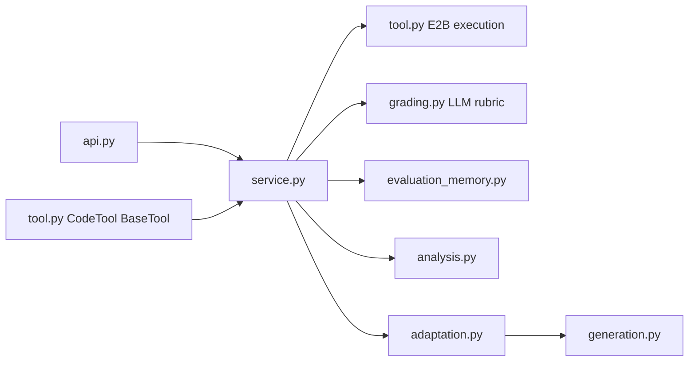

# Code Execution Feature

Adaptive coding assessment with E2B sandbox execution, LiteLLM challenge
generation/grading, platform memory rows, and an examiner-agent `BaseTool`.

## Architecture



| File | Responsibility |
|------|----------------|
| `api.py` | REST routes under `/api/v1/code` |
| `service.py` | Challenge CRUD, sandbox submit, adaptive submit orchestration |
| `tool.py` | E2B execution helpers plus examiner-agent `CodeTool` |
| `grading.py` | Silent LLM rubric persistence into `grade_results` |
| `evaluation_memory.py` | Silent memory-card extraction |
| `analysis.py` | Skill dimension aggregation |
| `adaptation.py` | Next-question contract from scores, learner profile, and admin config |
| `generation.py` | LLM-authored Python/JavaScript challenges |
| `languages.py` | Per-language sandbox runner and generator prompt rules |

## Examiner Agent Contract

`CodeTool` implements `BaseTool` and accepts `CodeToolInput`:

- `challenge_id`
- `session_id`
- `assessment_id`
- `submitted_code`
- `question_index`
- `difficulty`

It returns `CodeToolOutput`:

- `received`
- `submission_id`
- `contract`

The output is intentionally silent: it does not include sandbox score, LLM
rubric feedback, test details, memory-card evidence, or cumulative dimension
scores. Those records are persisted for platform reporting and adaptation only.

## Adaptive Loop

Official submit runs four layers:

1. E2B sandbox execution plus LLM rubric persistence.
2. Memory-card extraction into `memory_cards` and `code_memory_cards`.
3. Skill dimension aggregation into `skill_dimension_scores`.
4. Adaptive contract computation for the next coding challenge.

The learner-facing API returns a safe contract containing only the fields needed
to continue the flow. Challenge generation recomputes the rich contract
server-side from the database, so private memory summaries never need to round
trip through the browser.

## Adaptation Policy

`adaptation.py` reads both platform tables when available:

- `assessment_sessions.learner_profile_json` chooses the first difficulty from
  learner level (`junior`/`beginner`, `mid`/`intermediate`,
  `senior`/`advanced`).
- `assessments.blueprint_json` or `assessments.tool_config` can configure:
  - `coding.max_questions`
  - `coding.initial_difficulty`
  - `coding.difficulty_thresholds.intermediate`
  - `coding.difficulty_thresholds.advanced`

Example:

```json
{
  "coding": {
    "max_questions": 4,
    "initial_difficulty": "intermediate",
    "difficulty_thresholds": {
      "intermediate": 4,
      "advanced": 8
    }
  }
}
```

When no admin config exists, conservative defaults keep the demo runnable.

## APIs

Base path: `/api/v1/code`

| Method | Path | Description |
|--------|------|-------------|
| `GET` | `/languages` | Supported sandbox languages |
| `POST` | `/generate-challenge` | Generate and persist the next LLM-authored challenge |
| `POST` | `/adaptive-submit` | Official submit; silently grades, stores memory, and adapts |
| `POST` | `/submissions` | Practice sandbox run used by **Run tests** |
| `GET` | `/submissions/{id}` | Submission details, used for practice runs |
| `POST` | `/challenges` | Manual challenge creation |
| `GET` | `/challenges` | Manual challenge listing |
| `GET` | `/challenges/{id}` | Challenge detail with hidden expected outputs omitted |

## E2B Execution

- Python writes `solution.py` and `runner.py`; JavaScript writes `solution.js`
  and `runner.js`.
- Sandbox creation uses an E2B timeout, command execution uses the challenge
  time limit, and the host coroutine wraps the whole operation with
  `asyncio.wait_for`.
- Timeout and cold-start timeout paths return `sandbox_timeout` and kill the
  sandbox best-effort.
- Missing API keys return `sandbox_unavailable`.

Requires `E2B_API_KEY` for live execution.

## Frontend Behavior

`Run tests` is a practice-only sandbox path and can show visible test feedback.
`Submit answer` is official: the UI only acknowledges that the answer was saved
and prepares the next question. It does not show LLM rubric feedback, memory
summary, cumulative dimension scores, or official grading details during the
session.

## Development

```bash
docker compose -f docker-compose.yml -f docker-compose.dev.yml up
docker compose exec backend alembic -c migrations/alembic.ini upgrade head
```

## Testing

```bash
docker compose exec backend pytest tests/features/test_code.py tests/features/test_code_adaptive_loop.py -v
docker compose exec backend pytest tests/features/test_code_generation.py tests/features/test_code_languages.py -v
```

Unit tests mock E2B and cover sandbox timeouts, cold-start timeouts, BaseTool
silent output, generation, language runners, and adaptation boundaries.

Live E2B smoke tests are opt-in:

```bash
E2B_API_KEY=... RUN_E2B_INTEGRATION=1 docker compose exec backend pytest tests/features/test_code.py -m integration -v
```
