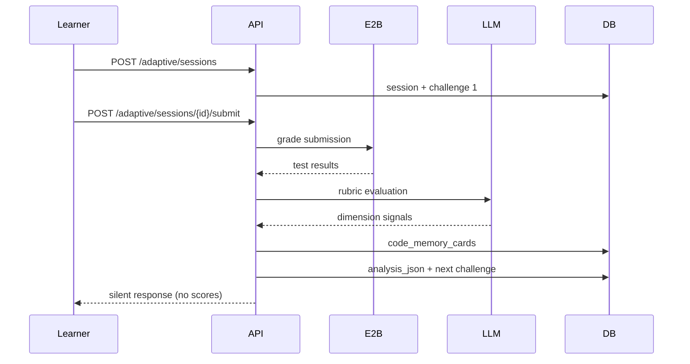

# Code Execution Feature (E2B)

End-to-end coding assessment: LLM challenge generation, timed sessions, E2B sandbox execution, and LLM evaluation.

## Architecture

```
api.py → service.py → tool.py → E2B Sandbox
         ↓                    ↑
    models.py              connect + reuse
         ↓
  app/challenges/     app/evaluation/
  (LLM generation)      (LLM grading)
         ↓
  app/admin/            (global timing config)
```

| Layer | Responsibility |
|-------|----------------|
| `api.py` | REST routes: sessions, runs, submissions, challenges |
| `service.py` | Timed sessions, challenge CRUD, run vs submit orchestration |
| `tool.py` | E2B only — create/connect sandbox, execute tests, weighted score |
| `timers.py` | Session and per-challenge expiry enforcement |
| `register.py` | Feature + LangGraph tool descriptor |
| `agent_tool.py` | LangChain `StructuredTool` for examiner agent graphs |
| `session_metrics.py` | Prometheus `active_sessions` gauge hooks |
| `app/challenges/` | LLM challenge generator with admin time budgets |
| `app/evaluation/` | LLM rubric evaluation after E2B correctness |
| `app/admin/` | Global platform config (`PlatformChallengeConfig`) |

## Data Model

```
PlatformCodeConfig (single row)
CodeChallenge 1──* TestCase
CodeChallenge 1──* CodeSubmission
CodeAssessmentSession 1──* CodeChallengeAttempt 1──* CodeRun
```

- `candidate_time_seconds` — LLM-assigned working time per challenge
- `time_limit_seconds` — E2B command timeout per run (not the learner timer)

## API

Base path: `/api/v1/code`

| Method | Path | Description |
|--------|------|-------------|
| POST | `/sessions` | Start timed assessment (profile → generate N challenges) |
| GET | `/sessions/{id}` | Session status, timers, challenge slots |
| POST | `/runs` | Practice run — visible tests only, unlimited until timer expires |
| POST | `/submissions` | Final grade — full tests + LLM (routes `assess-*` sessions) |
| POST | `/adaptive/sessions` | Start adaptive session (one challenge at a time) |
| POST | `/adaptive/sessions/{id}/submit` | Silent submit → evaluate → analyze → adapt |
| GET | `/adaptive/sessions/{id}/analysis` | Mentor dimension estimates |
| GET | `/adaptive/sessions/{id}` | Adaptive session view |
| POST | `/challenges/generate` | Generate challenges without starting a session |
| POST | `/challenges` | Bootstrap challenge (admin/dev) |
| GET | `/challenges` | List challenges |
| GET | `/challenges/{id}` | Learner view (hidden expected outputs stripped) |
| GET | `/submissions/{id}` | Graded submission with evaluation payload |

Admin: `/api/v1/admin/code-config` (GET public, PUT with `X-Admin-Key` or `SECRET_KEY` in dev)

### Timed session flow

```bash
# 1. Start session
curl -X POST http://localhost:8000/api/v1/code/sessions \
  -H "Content-Type: application/json" \
  -d '{"name":"Alex","skills":["Python"],"experience_level":"intermediate"}'

# 2. Practice run (visible tests)
curl -X POST http://localhost:8000/api/v1/code/runs \
  -H "Content-Type: application/json" \
  -d '{"session_id":"assess-abc","challenge_id":1,"submitted_code":"def solution(s): return s[::-1]"}'

# 3. Submit for grading
curl -X POST http://localhost:8000/api/v1/code/submissions \
  -H "Content-Type: application/json" \
  -d '{"session_id":"assess-abc","challenge_id":1,"submitted_code":"def solution(s): return s[::-1]"}'
```

## E2B Flow

1. **Run** — `include_hidden=false`, `keep_sandbox=true`, reuses `e2b_sandbox_id` on the attempt
2. **Submit** — kills sandbox, runs all tests, grades via LLM, marks attempt submitted (one per challenge)
3. Results written to `/home/user/.masaar/results.json` and read via `sandbox.files.read`

Requires `E2B_API_KEY`. Health check: `GET /health` includes `"e2b": true/false`.

## Challenge generation

Users never author challenges. The LLM assigns `candidate_time_seconds` by difficulty within admin bounds (`total_time_minutes`, min/max per challenge). Normalization lives in `app/challenges/time_budget.py`.

## Evaluation

After E2B execution on submit, `evaluate_code_submission` returns score breakdown, strengths, weaknesses, and `next_difficulty`. Uses `app.structured_llm` with `streaming=False` for reasoning models.

## Agent integration

```python
from app.features.registry import discover_langchain_tools
from app.features.code.agent_tool import run_adaptive_code_turn
from app.features.code.adaptive_schemas import CodeToolInput, CodeToolOutput
from app.integrations.agent_bridge import run_code_challenge
from shared.schemas.question import NextQuestion

tools = discover_langchain_tools()  # includes code_execution StructuredTool
# Adaptive turn (silent — no learner scores):
# output: CodeToolOutput = await run_adaptive_code_turn(CodeToolInput(...))
# Chat dispatch (learner must connect WebSocket first):
# answer = await run_code_challenge(next_question)
# WS (backend :8000 — not the Next.js :3000 URL):
# ws://localhost:8000/api/v1/integrations/sessions/{session_id}/ws
# Learner UI must show "Connected" before running push_question_and_await.
# Push next challenge (dev): POST /api/v1/integrations/sessions/{id}/push-next
# Full examination: POST /api/v1/integrations/sessions/{id}/examine
```

Low-level descriptor entrypoint: `tool.execute_submission` (see `register.py`).

Shared contracts: `shared/schemas/` · capability manifest: `GET /api/v1/integrations/capabilities`

Multi-challenge session summary (agent/orchestration): `GET /api/v1/integrations/sessions/{id}/timed-summary`

## Sprint 2 — Adaptive loop

One-challenge-at-a-time adaptation replaces upfront batch generation for adaptive sessions.

| Layer | Module | Role |
|-------|--------|------|
| Agent I/O | `adaptive_schemas.py`, `agent_tool.py` | `CodeToolInput` / `CodeToolOutput`, `run_adaptive_code_turn` |
| Evaluation | `evaluation_memory.py`, `grading.py` | E2B + LLM rubric → `code_memory_cards` |
| Analysis | `analysis.py` | Aggregate cards → `LearnerCodeAnalysis` |
| Adaptation | `adaptation.py`, `generator.py` | Next difficulty/category + `generate_single_adaptive_challenge` |
| HTTP | `adaptive_service.py`, `/code/adaptive/*` | Standalone adaptive loop without Celery |
| Graph | `agent/graph/` | `init_session` → `adapt_and_push` → `evaluate_turn` → loop |

Full documentation: [SPRINT2_ADAPTIVE.md](./SPRINT2_ADAPTIVE.md)



## Frontend

| URL | Component | Flow |
|-----|-----------|------|
| http://localhost:3000 | `page.tsx` | Profile → adaptive session (silent submit) → Finish |
| http://localhost:3000/code-demo | `code-demo/page.tsx` | Auto-starts demo session |
| http://localhost:3000/admin | `admin/page.tsx` | Global timing and generation config |
| Chat embed | `components/tools/CodeTool.tsx` | Monaco widget for examiner UI |

## Development

```bash
docker compose -f docker-compose.yml -f docker-compose.dev.yml up
docker compose exec backend alembic -c migrations/alembic.ini upgrade head
./scripts/e2e-code.sh
```

## Testing

```bash
docker compose exec backend pytest tests/ -v
docker compose exec -e TEST_DATABASE_URL=postgresql+asyncpg://postgres:password@db:5432/masaar_test backend pytest tests/ -v -m integration
```

Live E2B: set `E2B_API_KEY` and `RUN_E2B_INTEGRATION=1`.
