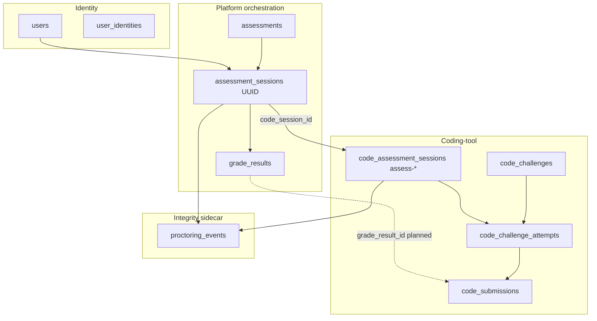
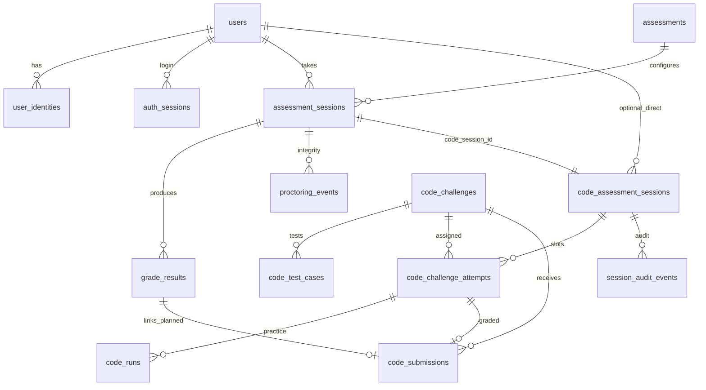

# Coding-Tool Database Schema (+ Users & Orchestration)

PostgreSQL schema for the **code execution feature slice**, **learner identity (auth)**, and the **minimum platform tables** that orchestrate the LangGraph examiner with the coding-tool. This document intentionally excludes other feature artifacts (MCQ, voice, diagram, reports, judge, Qdrant).

For the full platform schema see [database-schema-readme.md](./database-schema-readme.md).

**Legend:** ✅ Implemented · 🔶 Partial · 📋 Planned

---

## 1. Scope

### In scope

| Layer | Tables | Why |
|-------|--------|-----|
| **Users & auth** | `users`, `user_identities`, `email_verification_tokens`, `password_reset_tokens`, `auth_sessions` | Google / GitHub / email sign-in |
| **Orchestration (platform glue)** | `assessments`, `assessment_sessions`, `grade_results` | Agent session, WebSocket channel, canonical grades |
| **Coding-tool** | `platform_code_config`, `code_*`, `session_audit_events` | Challenges, timed sessions, E2B runs/submissions |
| **Integrity sidecar** | `proctoring_events` | Used during code sessions (parallel to tool dispatch) |

### Out of scope (other feature owners)

`voice_transcripts`, `diagram_responses`, `judge_verdicts`, `reports`, MCQ tables, Qdrant collections.

### External (not SQL tables)

| System | Role in coding-tool orchestration |
|--------|-----------------------------------|
| **Redis** | Celery broker; WS pub/sub (`masaar:session:{platform_uuid}:*`) between worker and API |
| **LangGraph checkpoints** | Postgres tables via `AsyncPostgresSaver` — agent resume (separate from Alembic) |

---

## 2. Orchestration model

The coding-tool can run in **two modes**. Both use the same `code_*` tables; the platform layer is required for agent-driven flow.



### Dual session identifiers

| ID | Table | Example | Used by |
|----|-------|---------|---------|
| **Platform session** | `assessment_sessions.session_id` | UUID | `POST /api/v1/sessions`, WebSocket `/integrations/sessions/{id}/ws`, `grade_results.session_id` |
| **Code session** | `code_assessment_sessions.session_id` | `assess-abc123` | `POST /api/v1/code/sessions`, Run/Submit APIs, `code_submissions.session_id` |

**Bridge column:** `assessment_sessions.code_session_id` → `code_assessment_sessions.session_id`

### Typical agent-driven lifecycle

1. Authenticated user → `POST /api/v1/sessions` → row in `assessment_sessions` (`pending`).
2. Celery worker runs LangGraph → creates `code_assessment_sessions` → sets `code_session_id`.
3. Examiner pushes `NextQuestion` over WebSocket (platform UUID).
4. Learner submits code → `code_submissions` + adapter → `grade_results` (platform UUID).
5. Proctoring events recorded against platform UUID and/or `assess-*` (as-built string key).
6. Session completes → `assessment_sessions.status = completed`, `code_assessment_sessions.status = completed`.

### Standalone mode (no agent)

1. User (anonymous today, `user_id` when auth lands) → `POST /api/v1/code/sessions`.
2. Only `code_*` + `proctoring_events` + `session_audit_events` are written.
3. No `assessment_sessions` row unless platform path is used.

### Adapter contract (orchestration code, not extra tables)

| Function | Location | Maps |
|----------|----------|------|
| `challenge_to_next_question()` | `integrations/adapters.py` | `SessionChallengeRead` → WebSocket `NextQuestion` |
| `submission_to_grade_result()` | `integrations/adapters.py` | `SubmissionRead` → `grade_results` row shape |
| `session_to_timed_summary()` | `integrations/adapters.py` | Code session → agent progress view |

Shared types: [shared/schemas/grading.py](../shared/schemas/grading.py), [shared/schemas/question.py](../shared/schemas/question.py).

---

## 3. Entity relationship (coding-tool scope)



---

## 4. Enums

```sql
CREATE TYPE auth_provider AS ENUM ('email', 'google', 'github');

CREATE TYPE platform_session_status AS ENUM (
  'pending', 'active', 'paused', 'completed', 'flagged'
);

CREATE TYPE assessment_status AS ENUM (
  'draft', 'active', 'archived'
);

CREATE TYPE grader_type AS ENUM ('e2b');  -- coding-tool uses e2b + LLM rubric in metadata
```

Code session status in app: `active` | `completed` | `expired` (VARCHAR, not PG enum).

---

## 5. Users & authentication (📋 Planned)

**Not migrated today.** Learners use a free-text profile; platform sessions store `token_hash` only.

### `users`

```sql
CREATE TABLE users (
    id              UUID PRIMARY KEY DEFAULT gen_random_uuid(),
    email           TEXT UNIQUE,
    email_verified  BOOLEAN NOT NULL DEFAULT false,
    display_name    TEXT NOT NULL,
    avatar_url      TEXT,
    password_hash   TEXT,
    is_active       BOOLEAN NOT NULL DEFAULT true,
    created_at      TIMESTAMPTZ NOT NULL DEFAULT now(),
    updated_at      TIMESTAMPTZ NOT NULL DEFAULT now()
);

CREATE INDEX ix_users_email ON users (email) WHERE email IS NOT NULL;
```

### `user_identities`

```sql
CREATE TABLE user_identities (
    id                UUID PRIMARY KEY DEFAULT gen_random_uuid(),
    user_id           UUID NOT NULL REFERENCES users (id) ON DELETE CASCADE,
    provider          auth_provider NOT NULL,
    provider_subject  TEXT NOT NULL,
    provider_email    TEXT,
    access_token_enc  TEXT,
    refresh_token_enc TEXT,
    created_at        TIMESTAMPTZ NOT NULL DEFAULT now(),
    UNIQUE (provider, provider_subject)
);

CREATE INDEX ix_user_identities_user_id ON user_identities (user_id);
```

### `email_verification_tokens`

```sql
CREATE TABLE email_verification_tokens (
    id          UUID PRIMARY KEY DEFAULT gen_random_uuid(),
    user_id     UUID NOT NULL REFERENCES users (id) ON DELETE CASCADE,
    token_hash  TEXT NOT NULL UNIQUE,
    expires_at  TIMESTAMPTZ NOT NULL,
    used_at     TIMESTAMPTZ
);
```

### `password_reset_tokens`

```sql
CREATE TABLE password_reset_tokens (
    id          UUID PRIMARY KEY DEFAULT gen_random_uuid(),
    user_id     UUID NOT NULL REFERENCES users (id) ON DELETE CASCADE,
    token_hash  TEXT NOT NULL UNIQUE,
    expires_at  TIMESTAMPTZ NOT NULL,
    used_at     TIMESTAMPTZ
);
```

### `auth_sessions`

Login refresh tokens — **not** the same as `assessment_sessions`.

```sql
CREATE TABLE auth_sessions (
    id                 UUID PRIMARY KEY DEFAULT gen_random_uuid(),
    user_id            UUID NOT NULL REFERENCES users (id) ON DELETE CASCADE,
    refresh_token_hash TEXT NOT NULL UNIQUE,
    user_agent         TEXT,
    ip_address         INET,
    expires_at         TIMESTAMPTZ NOT NULL,
    revoked_at         TIMESTAMPTZ,
    created_at         TIMESTAMPTZ NOT NULL DEFAULT now()
);

CREATE INDEX ix_auth_sessions_user_id ON auth_sessions (user_id);
```

---

## 6. Platform orchestration tables

Minimum platform DDL required for agent + coding-tool integration.

### `assessments` (✅ `0006`)

Blueprint defines code-only question plans for the examiner.

```sql
CREATE TABLE assessments (
    id              TEXT PRIMARY KEY,
    title           TEXT NOT NULL,
    status          TEXT NOT NULL DEFAULT 'active',
    blueprint_json  TEXT NOT NULL,
    created_at      TIMESTAMPTZ NOT NULL DEFAULT now(),
    updated_at      TIMESTAMPTZ NOT NULL DEFAULT now()
);
```

**Default seed:** `00000000-0000-4000-a000-000000000001` — 2× `code` question plans, 90 min.

### `assessment_sessions` (✅ `0006` + 📋 `user_id`)

```sql
CREATE TABLE assessment_sessions (
    session_id            TEXT PRIMARY KEY,
    assessment_id         TEXT NOT NULL REFERENCES assessments (id),
    user_id               UUID REFERENCES users (id),          -- 📋 Planned
    learner_profile_json  TEXT NOT NULL,
    status                TEXT NOT NULL DEFAULT 'pending',
    skill_scores_json     TEXT NOT NULL DEFAULT '{}',
    code_session_id       TEXT,                                -- → assess-*
    graph_checkpoint_json TEXT,                                -- 📋 LangGraph resume
    token_hash            TEXT NOT NULL,
    started_at            TIMESTAMPTZ,
    completed_at          TIMESTAMPTZ,
    created_at            TIMESTAMPTZ NOT NULL DEFAULT now(),
    updated_at            TIMESTAMPTZ NOT NULL DEFAULT now()
);

CREATE UNIQUE INDEX ix_assessment_sessions_token_hash ON assessment_sessions (token_hash);
CREATE INDEX ix_assessment_sessions_assessment_id ON assessment_sessions (assessment_id);
CREATE INDEX ix_assessment_sessions_status ON assessment_sessions (status);
CREATE INDEX ix_assessment_sessions_code_session_id ON assessment_sessions (code_session_id);
CREATE INDEX ix_assessment_sessions_user_id ON assessment_sessions (user_id);  -- 📋
```

| Column | Orchestration role |
|--------|-------------------|
| `code_session_id` | Links to coding-tool timed session |
| `token_hash` | Opaque learner token for session API (until JWT from `users` replaces it) |
| `learner_profile_json` | Snapshot of skills/name at start; mirrors `UserProfile` |
| `skill_scores_json` | Aggregated from code `evaluation_score` after examination |

### `grade_results` (✅ `0006`)

Canonical grade rows for the platform; coding-tool fills via `submission_to_grade_result()`.

```sql
CREATE TABLE grade_results (
    id                    BIGSERIAL PRIMARY KEY,
    session_id            TEXT NOT NULL REFERENCES assessment_sessions (session_id),
    question_id           TEXT NOT NULL,             -- e.g. code-{challenge_id}
    answer_raw            TEXT NOT NULL,
    grader_type           TEXT NOT NULL DEFAULT 'e2b',
    overall_score         DOUBLE PRECISION NOT NULL
                          CHECK (overall_score >= 0 AND overall_score <= 1),
    passed                BOOLEAN NOT NULL,
    grading_metadata_json TEXT NOT NULL DEFAULT '{}',
    created_at            TIMESTAMPTZ NOT NULL DEFAULT now(),
    updated_at            TIMESTAMPTZ NOT NULL DEFAULT now()
);

CREATE INDEX ix_grade_results_session_id ON grade_results (session_id);
CREATE INDEX ix_grade_results_question_id ON grade_results (question_id);
```

**`grading_metadata_json` for code:** `submission_id`, `passed_tests`, `total_tests`, `evaluation_score`, `evaluation_status`.

---

## 7. Coding-tool tables (✅ `0001`–`0005`)

### `platform_code_config` (✅)

```sql
CREATE TABLE platform_code_config (
    id          INTEGER PRIMARY KEY DEFAULT 1,
    config_json TEXT NOT NULL,
    created_at  TIMESTAMPTZ NOT NULL DEFAULT now(),
    updated_at  TIMESTAMPTZ NOT NULL DEFAULT now()
);
```

### `code_challenges` (✅)

```sql
CREATE TABLE code_challenges (
    id                     SERIAL PRIMARY KEY,
    title                  VARCHAR(255) NOT NULL,
    description            TEXT NOT NULL,
    starter_code           TEXT NOT NULL,
    language               VARCHAR(32) NOT NULL,
    time_limit_seconds     INTEGER NOT NULL,
    candidate_time_seconds INTEGER NOT NULL,
    created_at             TIMESTAMPTZ NOT NULL DEFAULT now(),
    updated_at             TIMESTAMPTZ NOT NULL DEFAULT now(),
    CONSTRAINT ck_code_challenges_language CHECK (
        language IN (
            'python', 'javascript', 'typescript', 'java', 'go',
            'csharp', 'ruby', 'rust', 'cpp'
        )
    ),
    CONSTRAINT ck_code_challenges_time_limit CHECK (time_limit_seconds BETWEEN 1 AND 300),
    CONSTRAINT ck_code_challenges_candidate_time CHECK (
        candidate_time_seconds BETWEEN 60 AND 7200
    )
);
```

### `code_test_cases` (✅)

```sql
CREATE TABLE code_test_cases (
    id              SERIAL PRIMARY KEY,
    challenge_id    INTEGER NOT NULL REFERENCES code_challenges (id),
    input           TEXT NOT NULL,
    expected_output TEXT NOT NULL,
    is_hidden       BOOLEAN NOT NULL DEFAULT false,
    weight          DOUBLE PRECISION NOT NULL DEFAULT 1.0,
    created_at      TIMESTAMPTZ NOT NULL DEFAULT now(),
    updated_at      TIMESTAMPTZ NOT NULL DEFAULT now(),
    CONSTRAINT ck_code_test_cases_weight CHECK (weight > 0 AND weight <= 100)
);

CREATE INDEX ix_code_test_cases_challenge_id ON code_test_cases (challenge_id);
```

### `code_submissions` (✅, target 🔶)

```sql
CREATE TABLE code_submissions (
    id                SERIAL PRIMARY KEY,
    challenge_id      INTEGER NOT NULL REFERENCES code_challenges (id),
    session_id        VARCHAR(64) NOT NULL,        -- assess-* (code session)
    submitted_code    TEXT NOT NULL,
    status            VARCHAR(32) NOT NULL,
    score             DOUBLE PRECISION,
    passed            BOOLEAN,
    grading_metadata  TEXT,
    created_at        TIMESTAMPTZ NOT NULL DEFAULT now(),
    updated_at        TIMESTAMPTZ NOT NULL DEFAULT now()
);

CREATE INDEX ix_code_submissions_challenge_id ON code_submissions (challenge_id);
CREATE INDEX ix_code_submissions_session_id ON code_submissions (session_id);

-- Orchestration target (📋):
-- ALTER TABLE code_submissions ADD COLUMN grade_result_id BIGINT
--   REFERENCES grade_results (id);
-- ALTER TABLE code_submissions ADD COLUMN sandbox_id TEXT;
```

### `code_assessment_sessions` (✅)

```sql
CREATE TABLE code_assessment_sessions (
    id              SERIAL PRIMARY KEY,
    session_id      VARCHAR(64) NOT NULL UNIQUE,
    user_id         UUID REFERENCES users (id),     -- 📋 Planned
    profile_json    TEXT NOT NULL,
    config_snapshot TEXT NOT NULL,
    status          VARCHAR(32) NOT NULL,
    started_at      TIMESTAMPTZ NOT NULL,
    expires_at      TIMESTAMPTZ NOT NULL,
    completed_at    TIMESTAMPTZ,
    created_at      TIMESTAMPTZ NOT NULL DEFAULT now(),
    updated_at      TIMESTAMPTZ NOT NULL DEFAULT now()
);

CREATE UNIQUE INDEX ix_code_assessment_sessions_session_id
    ON code_assessment_sessions (session_id);
```

### `code_challenge_attempts` (✅)

```sql
CREATE TABLE code_challenge_attempts (
    id                    SERIAL PRIMARY KEY,
    assessment_session_id INTEGER NOT NULL REFERENCES code_assessment_sessions (id),
    challenge_id          INTEGER NOT NULL REFERENCES code_challenges (id),
    started_at            TIMESTAMPTZ NOT NULL,
    expires_at            TIMESTAMPTZ NOT NULL,
    submitted_at          TIMESTAMPTZ,
    graded_submission_id  INTEGER REFERENCES code_submissions (id),
    e2b_sandbox_id        VARCHAR(128),
    run_count             INTEGER NOT NULL DEFAULT 0,
    created_at            TIMESTAMPTZ NOT NULL DEFAULT now(),
    updated_at            TIMESTAMPTZ NOT NULL DEFAULT now()
);

CREATE INDEX ix_code_challenge_attempts_session_id
    ON code_challenge_attempts (assessment_session_id);
CREATE INDEX ix_code_challenge_attempts_challenge_id
    ON code_challenge_attempts (challenge_id);
```

### `code_runs` (✅)

```sql
CREATE TABLE code_runs (
    id           SERIAL PRIMARY KEY,
    attempt_id   INTEGER NOT NULL REFERENCES code_challenge_attempts (id),
    outcome      VARCHAR(32) NOT NULL,
    passed_tests INTEGER NOT NULL DEFAULT 0,
    total_tests  INTEGER NOT NULL DEFAULT 0,
    error        TEXT,
    created_at   TIMESTAMPTZ NOT NULL DEFAULT now(),
    updated_at   TIMESTAMPTZ NOT NULL DEFAULT now()
);

CREATE INDEX ix_code_runs_attempt_id ON code_runs (attempt_id);
```

### `session_audit_events` (✅)

```sql
CREATE TABLE session_audit_events (
    id            SERIAL PRIMARY KEY,
    session_id    VARCHAR(64) NOT NULL,
    event_type    VARCHAR(64) NOT NULL,
    actor         VARCHAR(32) NOT NULL,
    metadata_json TEXT,
    created_at    TIMESTAMPTZ NOT NULL DEFAULT now()
);

CREATE INDEX ix_session_audit_events_session_id ON session_audit_events (session_id);
```

---

## 8. Integrity sidecar — `proctoring_events` (✅ `0003`)

Recorded in parallel during code sessions; orchestration reads via `GET /integrations/sessions/{id}/integrity-flags`.

```sql
CREATE TABLE proctoring_events (
    id               SERIAL PRIMARY KEY,
    session_id       VARCHAR(64) NOT NULL,
    event_type       VARCHAR(32) NOT NULL,
    severity         VARCHAR(16) NOT NULL,
    metadata_json    TEXT,
    client_timestamp TIMESTAMPTZ,
    created_at       TIMESTAMPTZ NOT NULL DEFAULT now(),
    updated_at       TIMESTAMPTZ NOT NULL DEFAULT now()
);

CREATE INDEX ix_proctoring_events_session_id ON proctoring_events (session_id);
CREATE INDEX ix_proctoring_events_event_type ON proctoring_events (event_type);
```

**Session key:** platform UUID in agent flow; `assess-*` in standalone flow. Target: always platform UUID once `user_id` auth is unified.

---

## 9. JSON columns reference (coding-tool scope)

| Table.Column | Content |
|--------------|---------|
| `assessments.blueprint_json` | `question_plans[]` with `question_type: "code"` |
| `assessment_sessions.learner_profile_json` | `name`, `skills`, `user_profile`, `consent_given` |
| `assessment_sessions.skill_scores_json` | e.g. `{"problem_solving": 0.85}` |
| `code_assessment_sessions.profile_json` | `UserProfile` snapshot |
| `code_assessment_sessions.config_snapshot` | Generated challenge manifest (ids, positions) |
| `platform_code_config.config_json` | `challenges_per_candidate`, `allowed_languages`, time budgets |
| `code_submissions.grading_metadata` | E2B results, LLM evaluation, rubric breakdown |
| `grade_results.grading_metadata_json` | Subset copied from submission for platform queries |

---

## 10. Migrations (coding-tool scope)

| Revision | Tables |
|----------|--------|
| `0001_code` | `code_challenges`, `code_test_cases`, `code_submissions` |
| `0002_timed_assessment` | `code_assessment_sessions`, `code_challenge_attempts`, `code_runs` |
| `0003_proctoring` | `proctoring_events` |
| `0004_constraints_audit` | CHECK constraints, `session_audit_events` |
| `0005_multilanguage` | Language CHECK (9 languages) |
| `0006_platform_sessions` | `assessments`, `assessment_sessions`, `grade_results` |
| `0007_auth_users` 📋 | §5 auth tables + `user_id` on §6–§7 session tables |
| `0007_code_orchestration` 📋 | `code_submissions.grade_result_id`, optional FK hardening |

```bash
# Coding-tool + orchestration (current branch)
docker compose exec backend alembic -c migrations/alembic.ini upgrade head
```

---

## 11. Minimum table sets by deployment mode

| Mode | Required tables |
|------|-----------------|
| **Standalone coding assessment** (`POST /code/sessions`) | `platform_code_config`, all `code_*`, `session_audit_events`, `proctoring_events` |
| **Agent-driven coding** (`POST /sessions` + worker) | Above + `assessments`, `assessment_sessions`, `grade_results` + Redis/Celery |
| **Authenticated learners** | Above + §5 auth tables + `user_id` FKs |

---

## 12. Write path summary

| Event | Tables touched |
|-------|----------------|
| User signs in (Google/GitHub/email) | `users`, `user_identities`, `auth_sessions` |
| Start platform session | `assessment_sessions` |
| Agent generates challenges | `code_challenges`, `code_test_cases`, `code_assessment_sessions`, `code_challenge_attempts`, update `assessment_sessions.code_session_id` |
| Practice run | `code_runs`, update `code_challenge_attempts.e2b_sandbox_id` |
| Submit for grade | `code_submissions`, update attempt, `grade_results` (agent path) |
| Proctoring event | `proctoring_events` |
| Session complete | `assessment_sessions`, `code_assessment_sessions`, `session_audit_events` |

---

## 13. Related documentation

- [coding-tool-tables-reference.md](./coding-tool-tables-reference.md) — column types, stored data, and examples per table
- [backend/app/features/code/README.md](../backend/app/features/code/README.md) — API and E2B flow
- [feature-contracts.md](./feature-contracts.md) — §5 code feature contract
- [system-architecture.md](./system-architecture.md) — Celery + WebSocket orchestration
- [database-schema-readme.md](./database-schema-readme.md) — full platform schema
